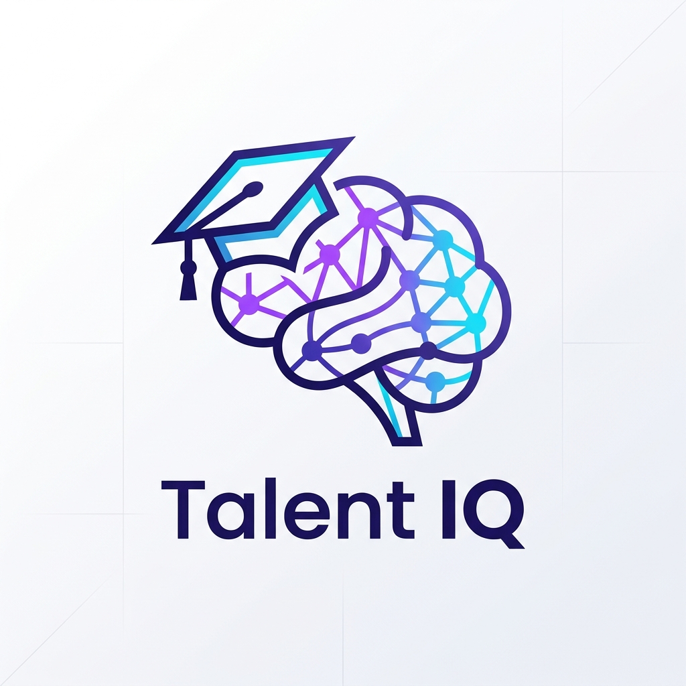

<div align="center">
  
  
  # ✨ Talent IQ: The Ultimate AI Interview Forge ✨

  [](https://github.com/Sehgalnikhil/talent-IQ/stargazers)
  [](https://github.com/Sehgalnikhil/talent-IQ/network/members)
  [](LICENSE)
  [](https://github.com/Sehgalnikhil/talent-IQ)

  **Bridging the gap between preparation and high-stakes performance using multi-modal AI agents.**

  [Explore the Platform](https://github.com/Sehgalnikhil/talent-IQ) • [View Demo](#-platform-highlights) • [Setup Guide](#-quick-start)
</div>

---

## 🚀 The Vision: Why Talent IQ?

In an era where "Standard" interview prep is no longer enough, **Talent IQ** leverages recursive AI telemetry and multi-modal agents to simulate real-world FAANG+ pressure. It's not just a platform; it's a **Neural Interview Engine** that tracks your cognitive complexity, emotional stress, and technical depth in real-time.

---

## 💎 Platform Highlights

### 🤖 AI Interview Orchestrator
A 9-stage personalized interview flow powered by **Gemini 2.5 Flash** (with local **Ollama** fallback).
*   **Multi-Persona Panel**: Practice with [The Stoic], [The Mentor], [The Chaos Monkey], or [The Recruiter].
*   **Adaptive Hostility**: Dial the pressure from a supportive mock to a "Bar Raiser" nightmare.
*   **Context-Aware**: The AI understands your Resume, GitHub PRs, and system design drawings.

### 🧑‍💻 Pro-Level Coding Environment
*   **VSCode-Powered Editor**: Premium Monaco-based experience with IntelliSense.
*   **Secure Sandbox**: Run Node.js, Python, Java, C++, and C in an isolated local environment.
*   **Cognitive Complexity**: Benchmarking O-notation telemetry to ensure your code is not just working, but optimal.

### 🧠 Advanced AI Telemetry
*   **Emotion Analytics**: Webcam-based stress detection to give you hints when you're panicking.
*   **Execution Tracing**: Step-by-step logic visualization of your variables.
*   **Flow Synthesis**: Automatic SVG flowchart generation for any code snippet.
*   **Architectural Vision**: Sketch a system design on the virtual whiteboard and get instant feedback from a Principal Architect agent.

---

## 🛠️ The Tech Stack

### Frontend (The Kinetic UI)
*   **Engine**: [Vite](https://vitejs.dev/) + [React 19](https://reactjs.org/)
*   **Styling**: [Tailwind CSS v4](https://tailwindcss.com/) + [DaisyUI 5](https://daisyui.com/) (Premium glassmorphism setup)
*   **Animation**: [Framer Motion](https://www.framer.com/motion/) + [GSAP](https://greensock.com/gsap/) + [Lenis](https://lenis.darkroom.engineering/) (Smooth scroll)
*   **Real-time**: [Stream SDK](https://getstream.io/) (Video/Audio) + [Socket.io](https://socket.io/)
*   **State**: [TanStack Query v5](https://tanstack.com/query/latest) (Data fetching/caching)

### Backend (The Neural Core)
*   **Node.js & Express**: High-performance RESTful API structure.
*   **AI Integration**: [Google Gemini Pro/Flash](https://ai.google.dev/) + [Ollama](https://ollama.com/) (Local models).
*   **Workflow**: [Inngest](https://www.inngest.com/) for complex event-driven background jobs.
*   **Auth**: [Clerk](https://clerk.com/) for secure, scalable identity management.
*   **Database**: [MongoDB](https://www.mongodb.com/) via Mongoose.
*   **Economy**: [Razorpay](https://razorpay.com/) (Credits-based economy).

---

## 🧪 Quick Start: Local Deployment

### 1. Prerequisites
*   Node.js (v18+)
*   MongoDB Instance (Local or Atlas)
*   [Ollama](https://ollama.com/) (Optional: for offline AI support)

### 2. Environment Setup

Create `.env` files in both directories following these structures:

#### Backend (`/backend/.env`)
```bash
PORT=5055
NODE_ENV=development
DB_URL=mongodb://localhost:27017/talent-iq

# AI & Events
GEMINI_API_KEY=your_gemini_key
INNGEST_EVENT_KEY=your_inngest_key
INNGEST_SIGNING_KEY=your_signing_key

# Video & Real-time
STREAM_API_KEY=your_stream_key
STREAM_API_SECRET=your_stream_secret

# Identity
CLERK_PUBLISHABLE_KEY=pk_test_...
CLERK_SECRET_KEY=sk_test_...

# Economy
RAZORPAY_KEY_ID=rzp_test_...
RAZORPAY_KEY_SECRET=your_razorpay_secret
```

#### Frontend (`/frontend/.env`)
```bash
VITE_API_URL=http://localhost:5055/api
VITE_CLERK_PUBLISHABLE_KEY=pk_test_...
VITE_STREAM_API_KEY=your_stream_key
```

### 3. Launch the Engine

#### Terminal 1: Backend
```bash
cd backend
npm install
npm run dev
```

#### Terminal 2: Frontend
```bash
cd frontend
npm install
npm run dev
```

---

## 🤝 Contributing
Contributions are what make the open-source community an amazing place to learn, inspire, and create. Any contributions you make are **greatly appreciated**.

1. Fork the Project
2. Create your Feature Branch (`git checkout -b feature/AmazingFeature`)
3. Commit your Changes (`git commit -m 'Add some AmazingFeature'`)
4. Push to the Branch (`git push origin feature/AmazingFeature`)
5. Open a Pull Request

---

<div align="center">
  Built with obsession at **Talent IQ Labs**. 
  
  [Back to Top](#-talent-iq-the-ultimate-ai-interview-forge-)
</div>
